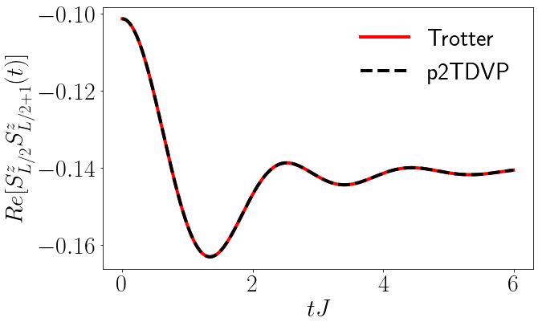

# Parallel-TDVP
This project contains codes to do parallel TDVP computations with the C++ verison of [ITensor](https://github.com/ITensor/ITensor) and is based on the algorithm presented by Secular et al. in [Phys. Rev. B 101, 235123](https://journals.aps.org/prb/abstract/10.1103/PhysRevB.101.235123).
The code is based on C++ version of the tensor-network library 
The parallel implementation reuses most of the code from the parallel DMRG algorithm [pDMRG](https://github.com/emstoudenmire/parallelDMRG) and the TDVP code on the ITensor TDVP repository [TDVP](https://github.com/ITensor/TDVP). Parts of this repository served as the basis for the computations done in 
[Phys. Rev. B 106, 155129 ](https://link.aps.org/doi/10.1103/PhysRevB.106.155129) (can also be found on the arXiv).
A comparision with a serial Trotter based method is seen in the Fig. 1.

  

Fig.1 - Comaprison p2TDVP with a serial Trotter algorithm.

# Possible improvements

* Obtain a more favorable scaling with number of tasks used.
* Calculating observable expectation values etc in parallel.
* Implement normalization.
